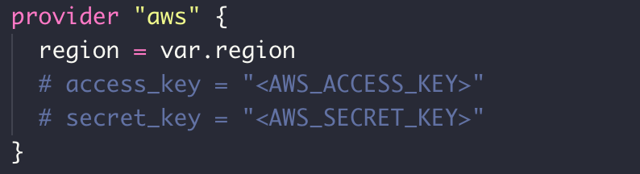

Terraform은 물리적 시스템, VM, 네트워크 스위치, 컨테이너 등과 같은 인프라 리소스를 생성, 관리 및 업데이트하는 데 사용됩니다. 거의 모든 인프라 유형이 Terraform의 리소스로 표현 될 수 있습니다.

아래 그림은 AWS Provider를 선언한 예시 코드입니다.

더 많은 정보를 확인 하시려면 아래 링크를 참고 하세요.

* https://www.terraform.io/docs/providers/index.html
